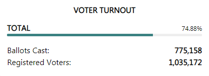

# Analysis of Oakland County, MI Voting Data

## Website Reported Statistics

This [site](https://results.enr.clarityelections.com/MI/Oakland/105840/web.264614/#/detail/35) reports the following statistics:

- Straight Ballots Cast: 449,462
- Federal Ballots Cast: 775,158
- Registered Voters: 1,035,172

Adding straight + federal gives **1,224,620** total ballots cast. This misleading graphic which only includes federal ballots cast makes it look like a typical 74.88% of voters cast a ballot:

When in reality an astounding 1,224,620 votes were cast, which is **119.45%** of registered voters.

Using the [detail data](https://results.enr.clarityelections.com//MI/Oakland/105840/269402/reports/detailtxt.zip) from the website, this scatter plot shows the percent of registered voters who cast a vote vs the Biden/Trump margin for each precinct reported.

